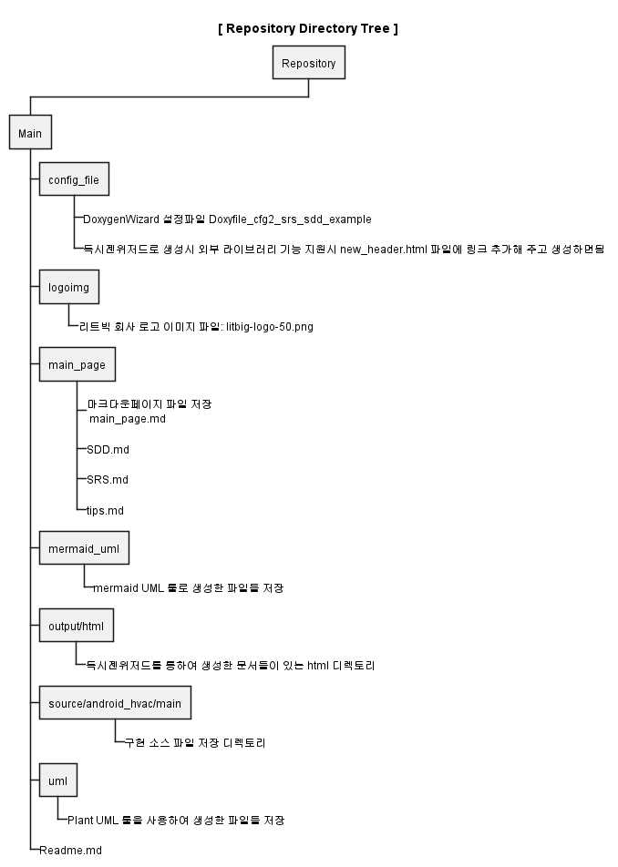
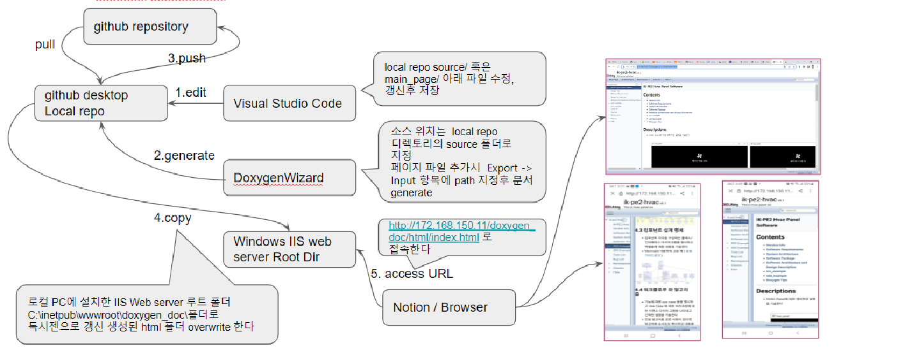

# doxygenExample

## Description
- Repository Main Branch Tree 구조

-------------------------------------------------------

## 작성및 관리
- Github 에 Doxygen 산출물과 개발소스코드 등록하고 편집/갱신시 파일 관리토록 하고  Local Web Server에 DoxygenWizard로 갱신한 파일들을 올려  노션이나 브라우져에서 갱신된 문서 내용을 확인 할 수 있도록 하자

- 기능별 산출물 작성시 마크다운 페이지 파일을 추가해서 작성 하는것을 권장함
- source/ 폴더 아래에 개발중인 prototyping 코드파일이나 폴더들을 추가 저장 한다  
- main_page 폴더에 신규 기능들에 대한 SRS/SDD markdown 페이지 파일을 추가해 주고  visual studio code 편집기를 사용하여 작성 하도록 하고  Notion에 공유된 Doxygen_setting 가이드를 참고하여  doxygenwizard -> Export -> Input 항목에 추가한 파일 위치를 추가해 준다

-------------------------------------------------------
### <a href="http://172.168.150.11/doxygen_doc/html/index.html">Main Page</a>
### <a href="http://172.168.150.11/doxygen_doc/html/md__c__workspace_doxygen_main_page__s_d_d.html">SDD Page</a>
### <a href="http://172.168.150.11/doxygen_doc/html/md__c__workspace_doxygen_main_page__s_r_s.html#srs_example">SRS Page</a>

-------------------------------------------------------

## 업데이트 이력

### [Updated] 2022-10-18 
- registered generated doxygen example document  
-------------------------------------------------------

