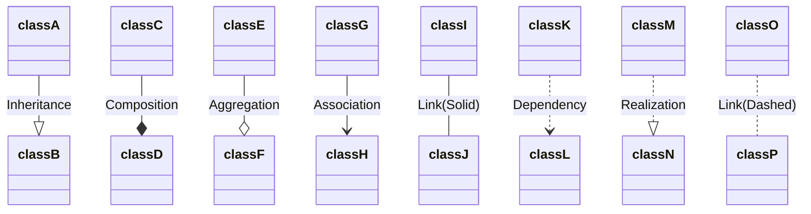
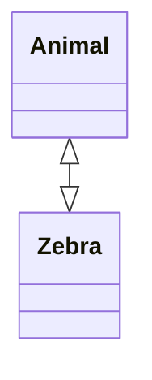
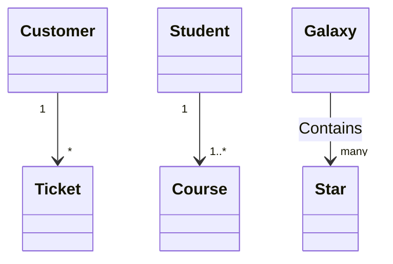
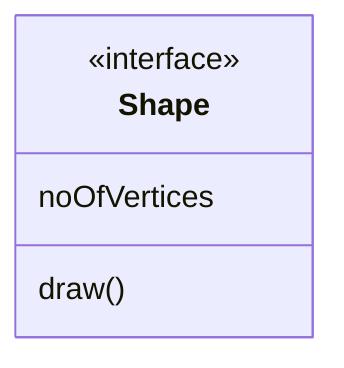
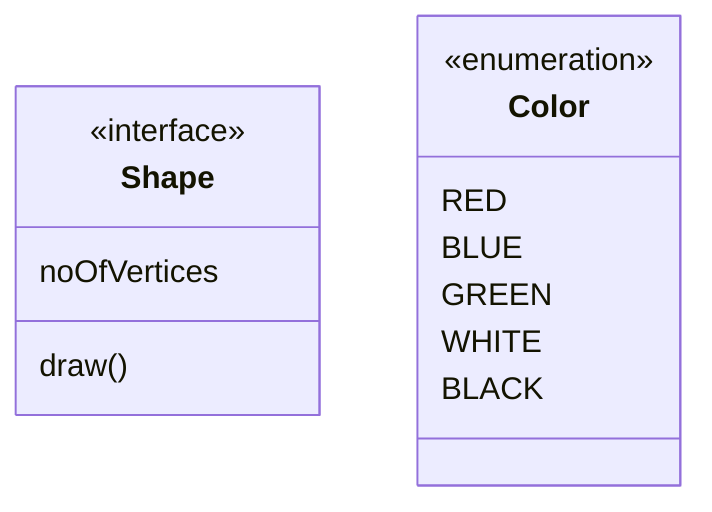
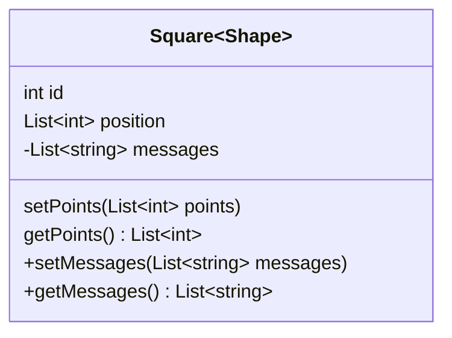
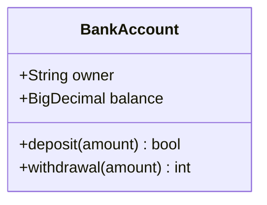

```mermaid
classDiagram
%% There are eight different types of relations defined for classes under UML which are currently supported:
%% + Public
%% - Private
%% # Protected
%% ~ Package/Internal
%% * Abstract e.g.: someAbstractMethod()*
%% $ Static e.g.: someStaticMethod()$
%% $ Static e.g.: String someField$

classA --|> classB : Inheritance
classC --* classD : Composition
classE --o classF : Aggregation
classG --> classH : Association
classI -- classJ : Link(Solid)
classK ..> classL : Dependency
classM ..|> classN : Realization
classO .. classP : Link(Dashed)
```

```mermaid
classDiagram
%% Relations can logically represent an N:M association:
Animal <|--|> Zebra
```

```mermaid
classDiagram
%% Multiplicity notations are placed near the end of an association.
Customer "1" --> "*" Ticket
Student "1" --> "1..*" Course
Galaxy --> "many" Star : Contains
```

```mermaid
classDiagram
%% Annotations are defined within the opening << and closing >>. There are two ways to add an annotation to a class, and either way the output will be same: <<Interface>> / <<Abstract>> / <<Service>> / <<Enumeration>>

class Shape
<<interface>> Shape
Shape : noOfVertices
Shape : draw()
```

```mermaid
classDiagram
%% In a nested structure along with the class definition:
class Shape{
    <<interface>>
    noOfVertices
    draw()
}
class Color{
    <<enumeration>>
    RED
    BLUE
    GREEN
    WHITE
    BLACK
}
```

```mermaid
classDiagram
%% generic Type Members can be defined using generic types, such as List<int>, for fields, parameters, and return types by enclosing the type within ~ (tilde). Note: nested type declarations such as List<List<int>> are not currently supported.
%% Generics can be represented as part of a class definition and also in the parameters or the return value of a method/function:
class Square~Shape~{
    int id
    List~int~ position
    setPoints(List~int~ points)
    getPoints() List~int~
}

Square : -List~string~ messages
Square : +setMessages(List~string~ messages)
Square : +getMessages() List~string~
```

```mermaid
classDiagram
%% return type Optionally you can end the method/function definition with the data type that will be returned.
class BankAccount{
    +String owner
    +BigDecimal balance
    +deposit(amount) bool
    +withdrawal(amount) int
}


```