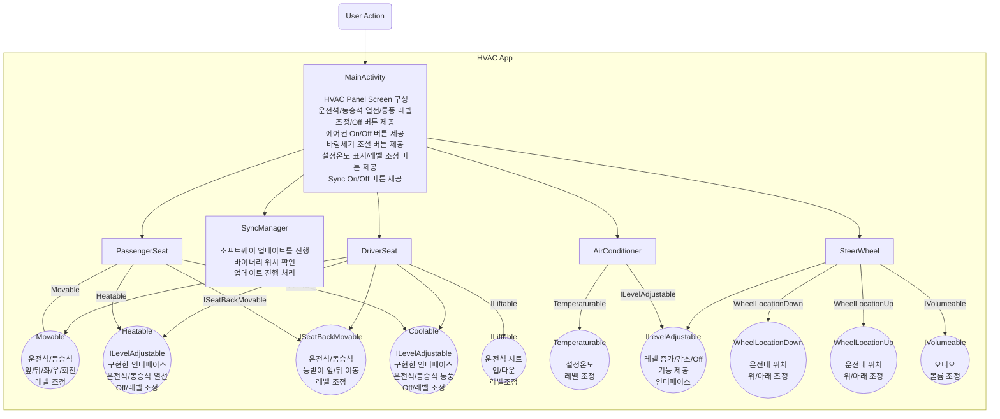
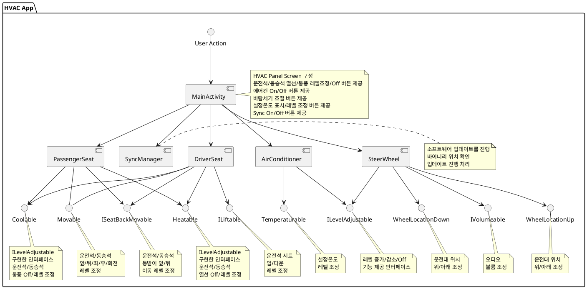
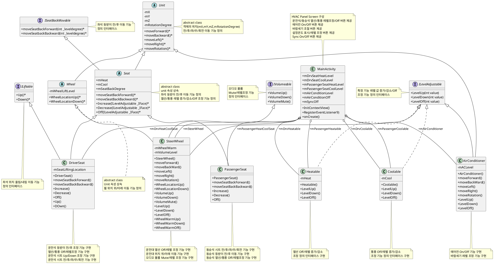
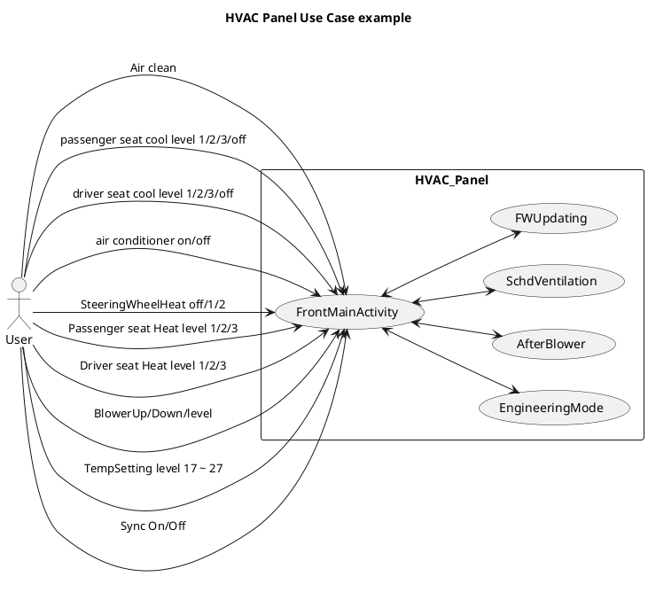
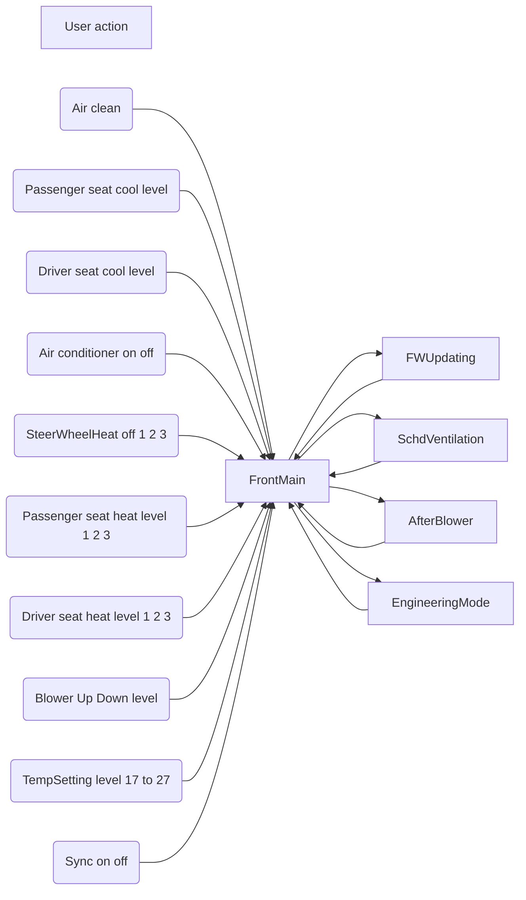
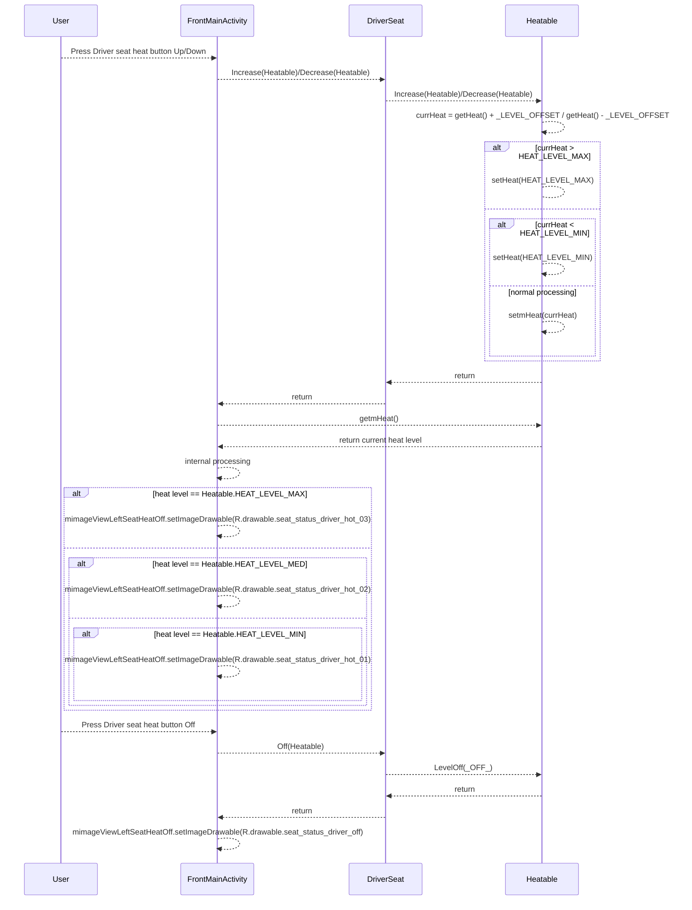
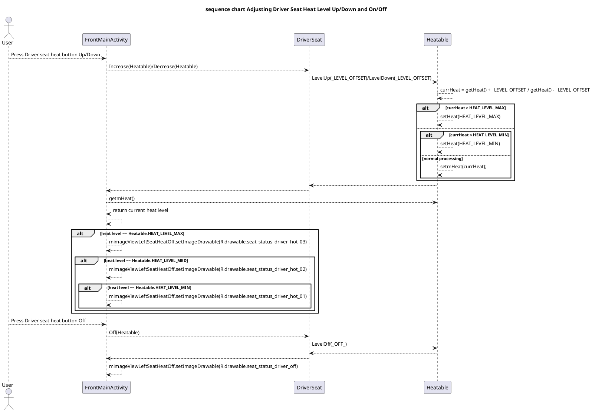
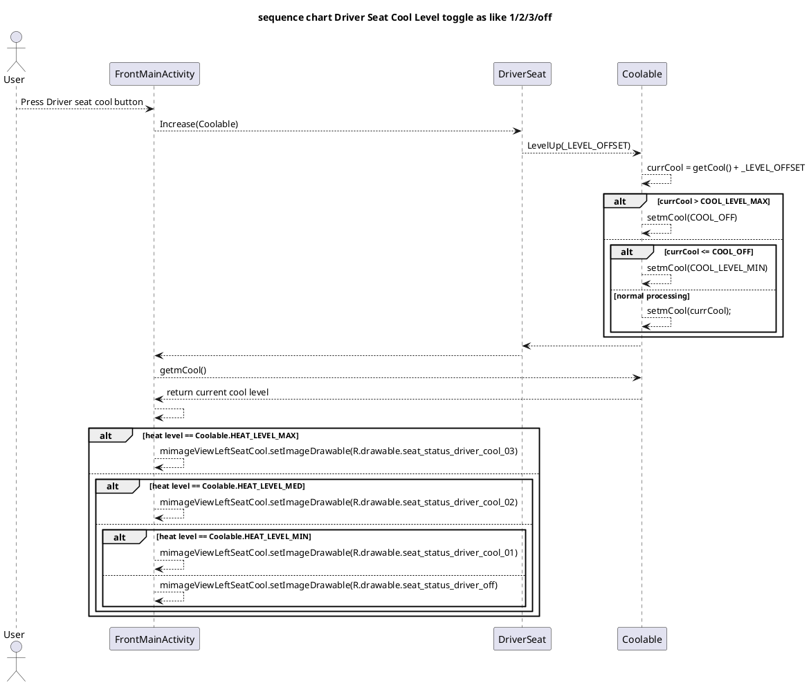

```mermaid
classDiagram 
%% <<
%% UML Notation Usage:
%% add * to Abstract e.g.: someAbstractMethod()*
%% add $ Static e.g.: someStaticMethod()$
%% add + Public
%% add - private
%% add # Protected
%% add ~ Package/Internal
%% classA --|> classB : Inheritance
%% classC --* classD : Composition
%% classE --o classF : Aggregation
%% classG --> classH : Association
%% classI -- classJ : Link(Solid)
%% classK ..> classL : Dependency
%% classM ..|> classN : Realization
%% classO .. classP : Link(Dashed)
%% >>
class Unit
<<abstrct>> Unit
Unit : -mX
Unit : -mY
Unit : -mZ
Unit : -mRotationDegree
Unit : +moveForward()*
Unit : +moveBackward()*
Unit : +moveLeft()*
Unit : +moveRight()*
Unit : +moveRotation()*

Unit <|-- Seat
Unit <|-- AirConditioner
Unit <|-- Wheel

ISeatBackMovable <|-- Seat

class ILevelAdjustable {
    <<interface>>
    +LevelUp(int value)
    +LevelDown(int value)
    +LevelOff(int value)
}

class ILiftable {
    <<interface>>
	+Up()*
	+Down()*
}

class IVolumeable {
    <<interface>>
	+VolumeUp()
	+VolumeDown()
	+VolumeMute()
}

class Seat {
    <<abstract>>
	+mHeat
	+mCool
	+mSeatBackDegree
	+moveSeatBackForward()*
	+moveSeatBackBackward()*
    +Increase(ILevelAdjustable _IFace)*
    +Decrease(ILevelAdjustable _IFace)*
    +Off(ILevelAdjustable _IFace)*
}

class Wheel {
    <<abstract>>
	-mWheelLiftLevel
	+WheelLocationUp()*
	+WheelLocationDown()*
}

class ISeatBackMovable {
    <<interface>>
    +moveSeatBackForward(int _leveldegree)*
    +moveSeatbackBackward(int _leveldegree)*
}

class MainActivity {
	+mDrvSeatHeatLevel
	+mDrvSeatCoolLevel
	+mPassengerSeatHeatLevel
	+mPassengerSeatCoolLevel
	+mAirConditionLevel
	+mAirConditionOff
	+mSyncOff
	+InitContextView()
	+RegisterEventListener9)
	+onCreate()
}


Seat <|-- DriverSeat
Seat <|-- PassengerSeat
Wheel <|-- SteerWheel

ILevelAdjustable <|.. Heatable
ILevelAdjustable <|.. Coolable
ILevelAdjustable <|-- AirConditioner
ILevelAdjustable <|-- SteerWheel 
IVolumeable <|-- SteerWheel
ILiftable  <|-- DriverSeat

MainActivity o-- DriverSeat : +mDrvHeatCoolSeat
MainActivity o-- PassengerSeat : +mPassengerHeatCoolSeat
MainActivity o-- AirConditioner : +mAirConditioner
MainActivity o-- Heatable : +mDrvHeatable 
MainActivity o-- Heatable : +mPassengerHeatable
MainActivity o-- Coolable : +mDrvCoolable
MainActivity o-- Coolable : +mPassengerCoolable
MainActivity o-- SteerWheel : +mSteerWheel

```

















